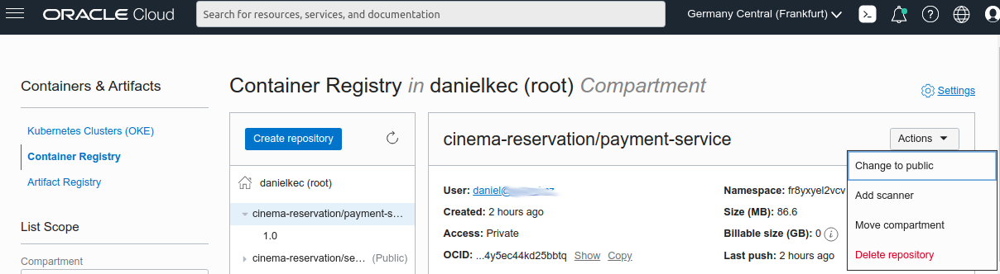

# Helidon Cinema Reservation
## MicroProfile LRA example

## Deploy to minikube
Prerequisites:
* Installed and started minikube
* Environment with 
[minikube docker daemon](https://minikube.sigs.k8s.io/docs/handbook/pushing/#1-pushing-directly-to-the-in-cluster-docker-daemon-docker-env) - `eval $(minikube docker-env)`

### Build images
As we work directly with 
[minikube docker daemon](https://minikube.sigs.k8s.io/docs/handbook/pushing/#1-pushing-directly-to-the-in-cluster-docker-daemon-docker-env)
all we need to do is build the docker images.
```shell
bash build.sh;
```
First build can take few minutes for all the artefacts to download,
subsequent builds are going to be much faster as the layer with dependencies gets cached.

### Deploy to minikube
```shell
bash deploy-minikube.sh
```
Script recreates whole namespace, any previous state of the `cinema-reservation` is obliterated.
Deployment is exposed via NodePort and url with port is printed at the end of the output:
```shell
namespace "cinema-reservation" deleted
namespace/cinema-reservation created
Context "minikube" modified.
service/booking-db created
service/lra-coordinator created
service/payment-service created
service/seat-booking-service created
deployment.apps/booking-db created
deployment.apps/lra-coordinator created
deployment.apps/payment-service created
deployment.apps/seat-booking-service created
service/cinema-reservation exposed
Application cinema-reservation will be available at http://192.168.99.107:31584
```

## Deploy to OCI OKE cluster
Prerequisites:
* [OKE k8s cluster](https://docs.oracle.com/en/learn/container_engine_kubernetes)
* OCI Cloud Shell with git, docker and kubectl configured for access OKE cluster
### Pushing images to your OCI Container registry
First thing you need is a place to push your docker images to, so 
OKE k8s can pull them from such place. 
[Container registry](https://docs.oracle.com/en-us/iaas/Content/Registry/Concepts/registryprerequisites.htm#Availab) 
is part of your OCI tenancy, to be able to push in it, you just need to 
`docker login <REGION_KEY>.ocir.io` in it.
Username of the registry is `<TENANCY_NAMESPACE>/joe@acme.com` 
where `joe@acme.com` is your OCI user. 
Password will be [auth token](https://docs.oracle.com/en-us/iaas/Content/Registry/Tasks/registrygettingauthtoken.htm) 
of your `joe@acme.com`
For getting region key and tenancy namespace just execute following cmd in your OCI Cloud Shell: 
```shell
# Get tenancy namespace and container registry
echo "" && \
echo "Container registry: ${OCI_CONFIG_PROFILE}.ocir.io" && \
echo "Tenancy namespace: $(oci os ns get --query "data" --raw-output)" && \
echo "" && \
echo "docker login ${OCI_CONFIG_PROFILE}.ocir.io" && \
echo "Username: $(oci os ns get --query "data" --raw-output)/joe@acme.com" && \
echo "Password: --- Auth token for user joe@acme.com" && \
echo ""
# Example output
>Container registry: eu-frankfurt-1.ocir.io
>Tenancy namespace: fr8yxyel2vcv
>
>docker login eu-frankfurt-1.ocir.io
>Username: fr8yxyel2vcv/joe@acme.com
>Password: --- Auth token for user joe@acme.com
```
Save your container registry, tenancy namespace and auth token for later.

When your local docker is logged in to OCI Container Registry, you can execute `build-oci.sh`
with container registry and tenancy namespace as the parameters.

Example:
```shell
bash build-oci.sh eu-frankfurt-1.ocir.io fr8yxyel2vcv
# Example output
>docker build -t eu-frankfurt-1.ocir.io/fr8yxyel2vcv/cinema-reservation/payment-service:1.0 .
...
>docker push eu-frankfurt-1.ocir.io/fr8yxyel2vcv/cinema-reservation/seat-booking-service:1.0
...
>docker build -t eu-frankfurt-1.ocir.io/fr8yxyel2vcv/cinema-reservation/seat-booking-service:1.0 .
...
>docker push eu-frankfurt-1.ocir.io/fr8yxyel2vcv/cinema-reservation/payment-service:1.0
...
```
The script will print out docker build commands before executing them. 
First build can take few minutes for all the artefacts to download, 
subsequent builds are going to be much faster as the layer with dependencies gets cached. 

To make your pushed images publicly available, 
open in your OCI console **Developer Tools**>**Containers & Artifacts**>
[**Container Registry**](https://cloud.oracle.com/registry/containers/repos)
and set both repositories **Public**



### Deploy to OKE
You can use freshly cloned helidon-lra-example repository in OCI Cloud shell 
as all you need are the k8s descriptors. Your changes are built to the 
images you have pushed in the previous step.

In the OCI Cloud shell: 
```shell
git clone https://github.com/danielkec/helidon-lra-example.git
cd helidon-lra-example
bash deploy-oci.sh

kubectl get services
>NAME                         TYPE           CLUSTER-IP      EXTERNAL-IP   PORT(S)          AGE
>booking-db                   ClusterIP      10.96.118.249   <none>        3306/TCP         34s
>lra-coordinator              NodePort       10.96.114.48    <none>        8070:32434/TCP   33s
>oci-load-balancing-service   LoadBalancer   10.96.170.39    <pending>     80:31192/TCP     33s
>payment-service              NodePort       10.96.153.147   <none>        8080:30842/TCP   32s
>seat-booking-service         NodePort       10.96.54.129    <none>        8080:32327/TCP   32s
```

You can see that right after deployment EXTERNAL-IP of the external LoadBalancer reads as `<pending>`
because OCI is provisioning it for you. But if you invoke `kubectl get services` a little later it will 
give you external ip address with Helidon Cinema example exposed on port 80.